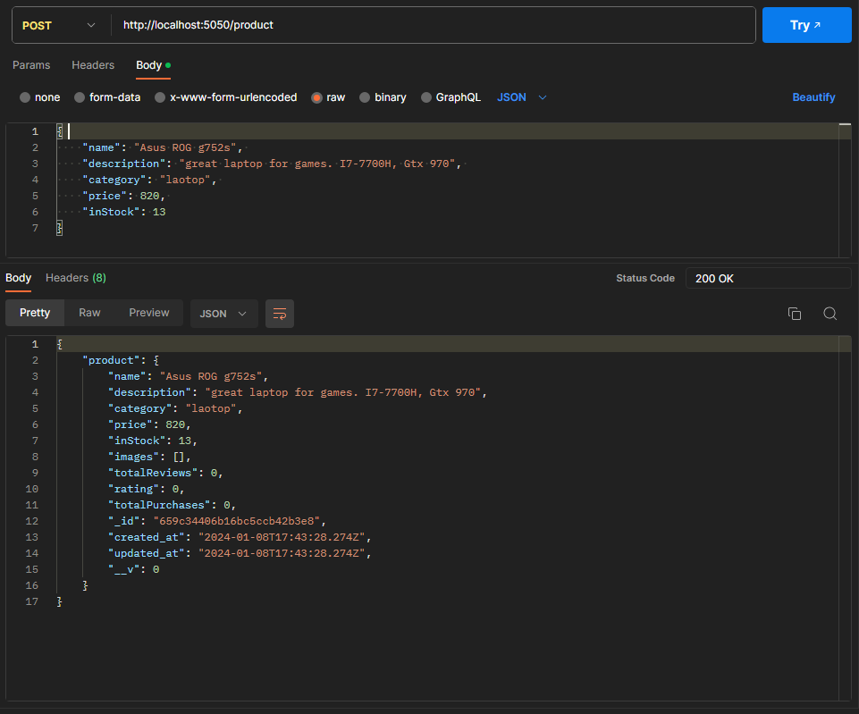

# Backend app made with Node.js and MongoDB for Product Management
## Overview:

This **REST-API**  was developed using Node.js, Express.js, and MongoDB, providing comprehensive CRUD functionality for product management and more.

## How to set-up and use:

- Clone this Repository to your local machine.
- Change the provided **.env** file to meet your needs such as setting up your MongoDB URI for your database, and if needed change the random given secret key that works for authentication, and the PORT as well if needed, but The CREDIT_CARDS_API is the free API that was provided.
- Either run **npm install**, and then **npm start** to run the server from the terminal, or run **docker-compose build** then **docker-compose up**, to set the docker containers and have it running there.
- Then use Postman or anyway you prefer to make api requests.

## Database schema and model design:

For the MongoDB database I went with 4 collections which are: **Users**, **Products**, **Orders**, **Reviews** to make the app work as needed and up for scaling easily. Here's a breakdown model for each collection: 

- **User collection:**  
    Which has all the basic information to make in an authentication system such as **first name**, **last name**, **email**, **passowrd**, **profile picture**. All the fields are self explanatory, the picture however will store a string in which can be a Base64 converted image or a link to the image after uploading it to the cloud.
   <pre>
    { 
	   firstName, 
	   lastName, 
	   email, 
	   password, 
	   profilePicture 
    } 
   </pre>

- **Products collection:** 
    To make a clean product management system i went with this model to give the users the ability to Create, Read, Update, Delete products and also purchase and review products. The product will be linked to the user that posted it with the unique Id of the user **OwnerId**. **The inStock** field will be the available amount of product ( 0 means the product isn't available). Images would be an array of strings that stores either Base64 or a link to an image. **totalReviews** would be the sum of the user that rated the product, and the **rating** would be the average of these rated (each rate would be 0-5) and lastly the **totalPurchases** would be the sum of users that bought the product.
    <pre>
    {
        ownerId,
        name,
        description,
        category,
        price,
        inStock,
        images,
        totalReviews,
        rating,
        totalPurchases
    }
    </pre>

- **order collection:** 
    To make a purchase of a product while tracking the details of the purchase, I've linked the order to both the product and user by their unique Id's, the **status** is the stats of the purchase if starts by pending at first, then the owner of the product can confirm it to become shipped. The user can make the quantity of the product as he like from the **quantity** field, and the totalPrice will be calculated then based on quantity and products price, and there's also **shippingAddress** where the product needs to be shipped, and lastly the **paymentMethod** in which the user have used to make this purchase.
    <pre>
    {
        userId,
        productId,
        status,
        quantity,
        totalPrice,
        shippingAddress,
        paymentMethod
    }
    </pre>

- **review collection:** 
    The review collection is a Basic one for users to give their opinions on products they've bought, it's linked to the user by **userId** and linked to product by **productId**, the user can set a rate between 0 and 5 and write a brief description to explain his rating.
    <pre>
    {
        userId,
        productId,
        rate,
        description
    }
    </pre>
   
## API endpoints usage: 
There are many api endpoints, here's a brief explanation on some of them:
- ***/auth/signup*:** The user would send a **post** request here if he wants to create a new account and wil be required to send these information along **{ email, password, confirmPassword, firstName, lastName }** then if the request is a success it will return the user details and a unique token that lasts for 7 days, that will give the user authorization to access some api endpoints.

- ***/auth/singup*:** if the user already have an account he can send a **post** request to this endpoint to send his **{ email, password }** to retrieve a unique token that lasts for 7 days.

- ***/auth/updateuser*:** The user can use this endpoint to update his account information by sending a **post** request of what he wants to change **firstName**, **lastName**, **email**, **password**…etc, along with **confirmPassowrd** to confirm that's his account (he can send one or any number of information he wants to change).

- ***/auth/refreshToken*:** this endpoint is to refresh a token of a user before it gets expired and give him another 7days.

- ***/product*:** 
- - By sending a **post** request here with the product information such **{ name, description, category, price, inStock }** the product will be created.
- - With a **Patch** request along with the productID in the params after the endpoint the user can change the information of the product that he made at first.
- - A **Delete** request in this endpoint will delete the product that has the id that was given in the params of the request.
- - Lastly a **Get** request will return the details of the product of the productId in the params.

an example on product creation:

- ***/product/search*:** The user can send a **Post** request here to get some specific products based on some criteria **{ pageNumber, itemsPerPage, productName, category, minPrice, maxPrice }**

an example on product search:

- ***/product/newReview*:** This **Post** request is for users to give their review and rate for a product they have bought.

- ***/product/updateReview*:** While this is a **Patch** request to update any review they have done if they changed their mind.

- ***/product/deleteReview*:** And the user can delete a review if he felt like it with this **Delete** request.

- ***/purchase*:** By sending a **Post** request here along with the productId in params, and specifying the quantity that the user wants of this product and his address and payment method he can make a purchase and keep track of it.

an example on making a purchase:

- ***/purchase/shipment*:** This endpoint is only for the owner of the product that have been bough, he can simply call it with his token to confirm the shipment of the product to the buyer.

- ***/purchase/userPurchases*:** This **Get** request is for the user to get all the purchases that he has done along side with each product information.

- ***/purchase/stats*:** This **Get** request is for the all users to see the total number of purchases and trending products and products with most sales on a period of time.

an example on purchase stats:

- ***/tests?size=20*:** At last this endpoint is to populate the database with fake data, it uses the library faker, just put the size of the data and it'll store in the database credit cards that it gets from the external API https://random-data-api.com/api/v2/credit_cards and filters them to only VISA and removes their number, and it'll create random users *(sometimes the users tends to be less than the size due to the password given by faker not passing the validation i've made)* and it'll create products and make purchases.

[Go here for all the requests with examples.](https://documenter.getpostman.com/view/28993914/2s9YsJDDW1)

## Docker containers: 
- Make sure you have Docker installed on your system.
- Clone the repository containing the Dockerfile and docker-compose.yaml. Ensure you have the necessary environment variables like DB_URI, SECRET_TOKEN, etc., ready to use.
- Open your terminal or command prompt and navigate to the directory containing the Dockerfile and docker-compose.yaml files. Then run **docker-compose build** and this command will build the Docker images defined in the docker-compose file.
- Run **docker-compose up** and this will start the containers. You'll see logs in the terminal showing the Node.js app and MongoDB starting up.
- Now you should be able to use the endpoints we've saw earlier on local host port 5050 if you didn't change it in the exposed port in yaml file.

## authentication: 
This app has a simple auth system, which the user has to Signup or Signing if he has an account to get a token that lasts for 7days, with this token the user can have the access to send requests to different endpoints such as creating a product or buying one or reviewing a product he have bought …etc
